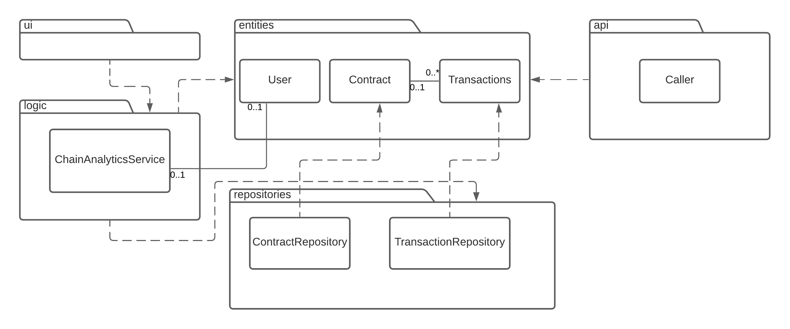

# Architecture of the app

# Package and class architecture

The program is structured in a three-layer architecture. 
The first layer is the user interface-layer handled by package ui.
The second layer is the logic layer handled by packages api and logic
The third layer is the data layer handled by the repositories package.
The entities package contains the definitions of the data-objects the app uses.

Below you can see package and class diagram of the app.


# UI

Implementation of the UI is separated into its own package. There are two separate views in the UI

- Transaction analysis
- Contract viewing

Both of these are implemented as their own class. The UI class is responsible for switching between these two views.
The listings in both views are done using tkinters Treeview class, which is recreated each time the user interacts with one of the buttons on the UI.
# App Logic

ChainAnalyticsService from the package logic and Caller from the package api are responsible for handling the functionality of the app. 

ChainAnalyticsService is responsible for the implementation of the functionality analyzing and saving the data gathered from the api. It communicates with the database using the repository classes in the repository package.

Class Caller is responsible for communication between the app and the Etherscan API. It is responsible for wrangling the API calls into usable form. The data is then passed onto the ChainAnalyticsService class which performs some functionalities with the given data. 

The reason for the separation of the API and it's analysis into Caller and ChainAnalyticsService classes respectively, is so that we can use other data sources for the app without changing the implementation of the whole app. 
# Data saving and retrieval

Classes TransactionRepository and ContractRepository from the repository package handle saving data into a database. Both repository classes save data into tables in a SQLite database. Transactions are saved into a table called transactions and Contracts in to a table named contracts

The database is initialized with the following schema:
```SQL
create table transactions (date text, hash text, from_address text, to_address text, amount real, gas real)
```
```SQL
create table contracts (date text, hash text, creator_address text, contract_address text, name text)
```

# Main features of the app

Here we describe some of the main functionalities of the program using sequence diagrams.
## Scanning for a new smart contract in the most recent block
One of the main functionalities of the app is to allow the user to scan for smart contracts created in the most recent block of the Ethereum blockchain. 


The event handler for the button "Get contracts in recent block" calls the function to add any recently created contracts from the most recent block to the database, which is implemented by the ChainAnalyticsService class of the logic package. The ChainAnalyticsClass then uses the Caller to call the Etherscan API to scan for any contract creations in the most recent block. If there are any, the app then creates instances of the Contract class and saves these to the database using the ContractRepository class. The UI then shows the most recently created contracts. 

## Finding all transactions by an address

The user can input a wallet address to the filter field in the transaction analyzer view of the UI. After clicking the find all transactions by address button, the event handler calls the function to add the most recent transactions of the wallet in question to the database. This is implemented by the ChainAnalyticsService class. ChainAnalyticsService then uses the Caller to call the Etherscan API for the most recent transactions of the wallet address in question. 
If there are any transactions, the app then creates instances of the Transaction class and saves these to the database using the TodoRepository class. The UI then shows all the recent transactions of the address.


## Filtering all transactions by from address.

The user can using the filter field in the transaction analyzer view of the UI filter for transactions in the database with a certain "from address". First the UI calls the event handler, which calls the function to extract all the transactions present in the database. This functions returns a list of transactions present in the database. The original call is initiated with a filter argument so that the event handler knows to filter by the from address. The UI now draws only the transactions with a matching from address to the filter on the transaction view.