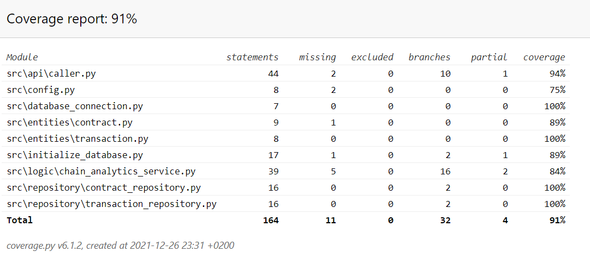

# Testing specification

## Coverage
We were able to achieve a above 91% branch coverage without taking the APP ui into account.

## Unit testing & Integration testing

### Logic
The app logic is tested using the TestChainAnalyticsService class. Each test initializes a database instance, so all of the tests are run on a clean sheet database.  The unit tests for the app logic involve usage of the repositories and therefore the repositories are not separately tested

We also test the functionality of the Caller class using the TestCallerAPI, to ensure the functionality of the Etherscan API communication. 

## System testing

System testing was performed manually. 

End-to-end usage testing has been performed for all the functionalities described in the specification document and they have found to be met and robust to intentionally adverse inputs from the user.

Installation has been performed on both a Windows and Linux environment in the manner described in the user guide. 

## Quality issues remaining in the app
- The app does not notify the user if they have inputted an invalid input to the filter fields and does nothing in an error situation.