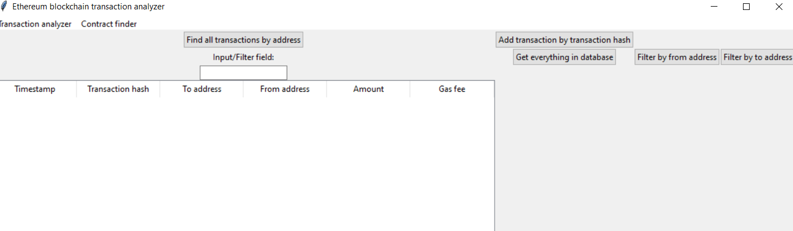
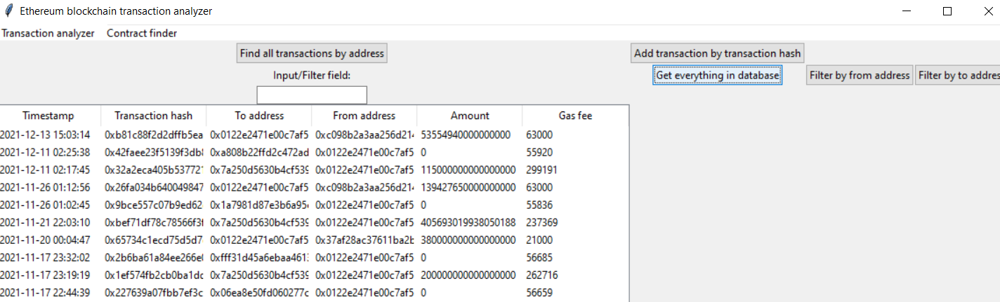
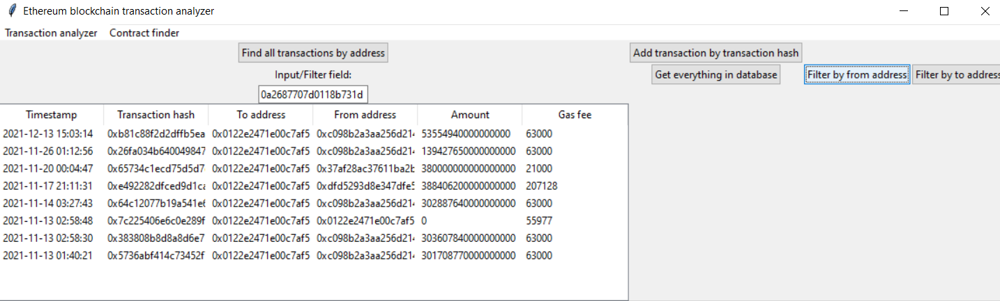
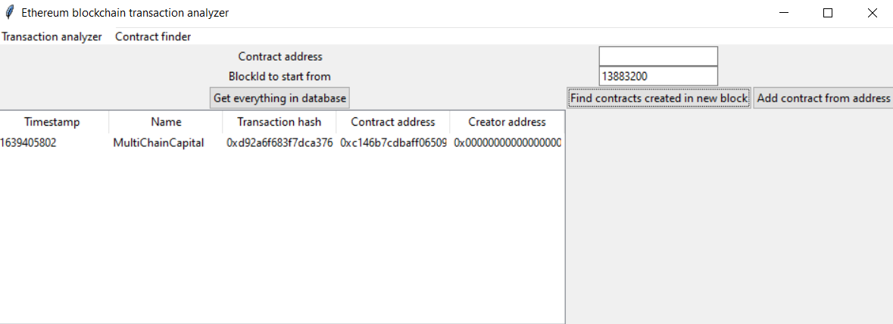

# Users guide

# Configuration
You can configure the app to use your own Etherscan API key by editing the .env file.

# Starting the app
Before you can run the app you should run the following commands in the console:

1. Install necessary dependencies
```bash
poetry install
```

2. Initialize the database

```bash
poetry run invoke build
```

3. Start the app with:

```bash
poetry run invoke start
```

If you face an error with importing etherscan run the following command:

```bash
pip install etherscan-python
```

# Running the app

After running the app using poetry invoke start you are greeted with the view of the transaction scanner.
You can navigate to the contract analysis tool by clicking the second option in the menu bar.



You can find and save new transactions to the database by entering a valid hexadecimal wallet address to the input/filter field. 

You can list all transactions in the database by clicking the "Get everything in database button"



By inputting a valid sender/receiver address to the filter field and clicking either of the filter by to/from buttons. You are able to filter the transactions in the database. 



Additionally, you can use the scroll wheel to scroll to transactions which are not visible in the initial view.
If you wish to copy an address from the table, you can right click on the correct row-column cell and paste the 
contents of that cell into the input/filter field.

## Contract view

The contract view functions similarly to the transaction view. 


One can input an valid contract address and add a contract from that address to the database.
Alternatively you can input a valid block number and scan that block for a contract creations. 
If there are any these are then added to the database.
